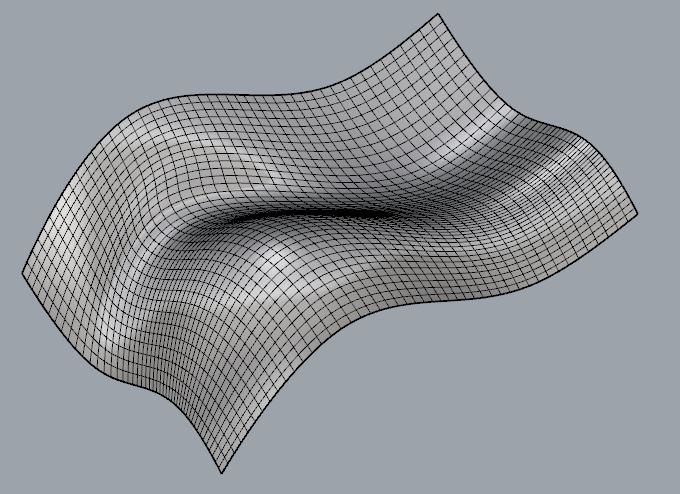
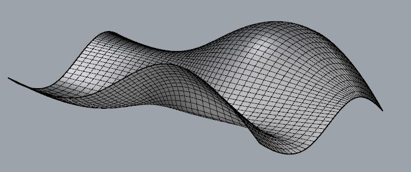
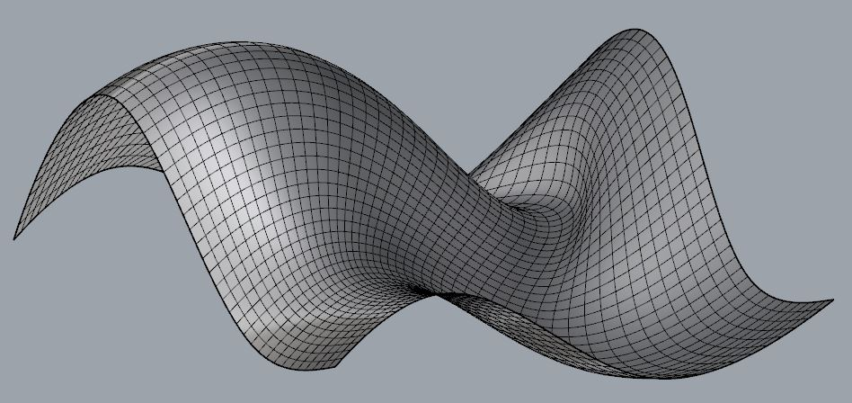
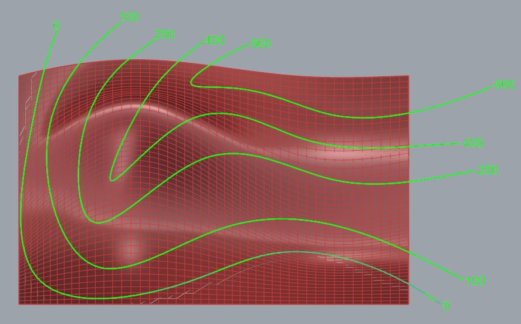
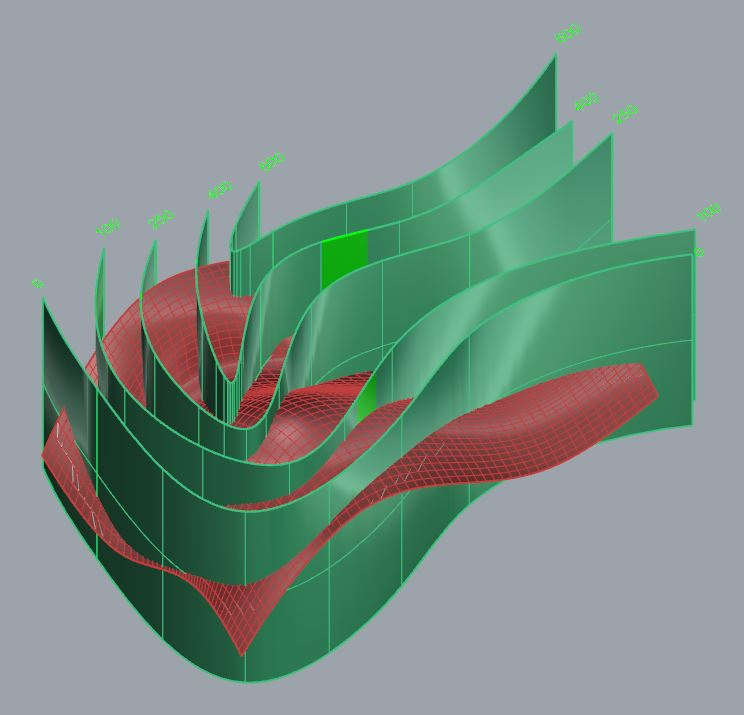
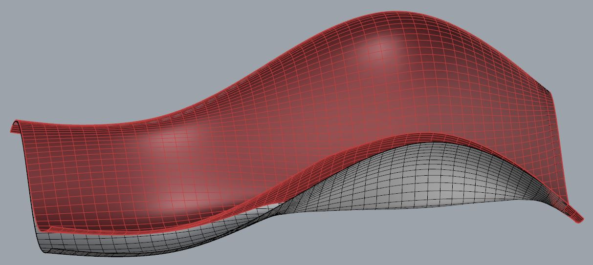
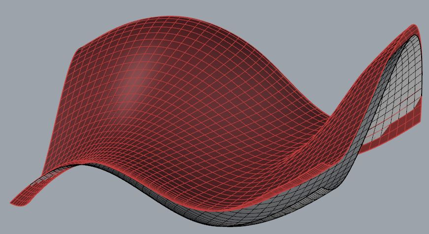

# About

This is a rhinocript that deviates a free form surface according to some predefined free form isolines.

### Views of some free form surface:

### Views of the isolines:

### Views of the new geometry on top of the old surface:

Please pay attention to the naming convention and the pairs of offseted isosurfaces representing the isolines in order the script to run properly.