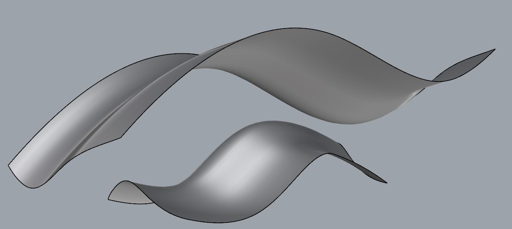

# About

This is a rhinocript that creates a middle surface between two arbitrary free form surfaces. The algorithm uses the [bisection method](http://en.wikipedia.org/wiki/Bisection_method) to find the position of a point in the middle between the surfaces. The number of points for the middle surface is hard coded in the script and in this run is an array of 10x10. This means that to generate this middle surface 100 points were used. The quality of the middle surface can be controlled by the size of this array.

### Views before and after the script:

