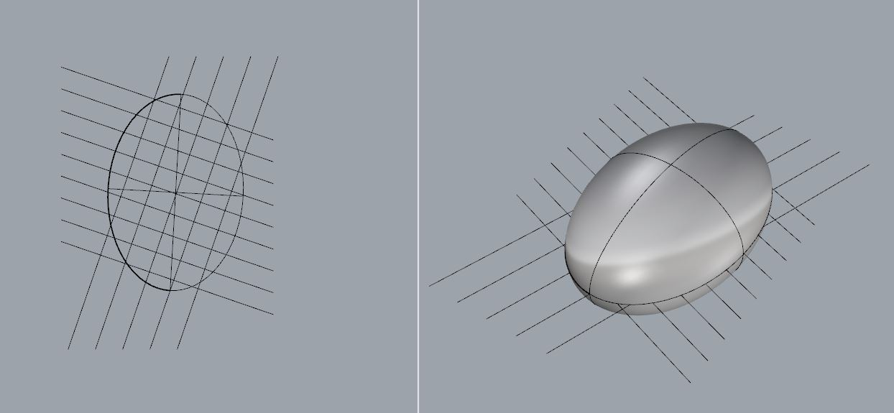

# About

This script was inspired of the [Metropol Parasol](http://en.wikipedia.org/wiki/Metropol_Parasol) structure. It represent very rudimentary algorithm how such paneling can be achieved. This script will run on any type of 3D volume shape and with any kind of arrangement of lines representing the paneling sections. At the moment this script works only with straight lines for the sectioning but it can be altered to work with any kind of spline.

### Views before and after the script:

